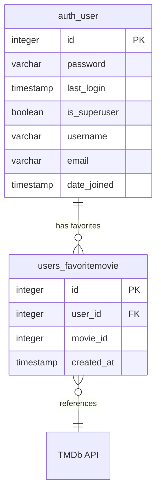

# Movie Recommender Database ERD

This Entity Relationship Diagram (ERD) represents the database schema for the Movie Recommender application as described in the Database_schema.md documentation.

## Notes

- The ERD shows two main entities: `auth_user` and `users_favoritemovie`
- There is a one-to-many relationship between users and favorite movies (one user can have many favorite movies)
- Movie metadata is not stored locally but is fetched from TMDb API using the movie_id
- Redis is used for caching movie details, trending movies, and recommendations, but is not part of the persistent database schema
- A unique composite index exists on (user_id, movie_id) in the users_favoritemovie table
- An index exists on created_at in the users_favoritemovie table for sorting